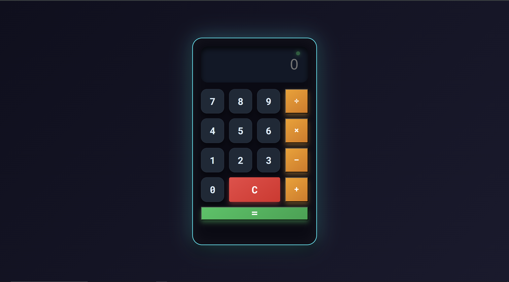
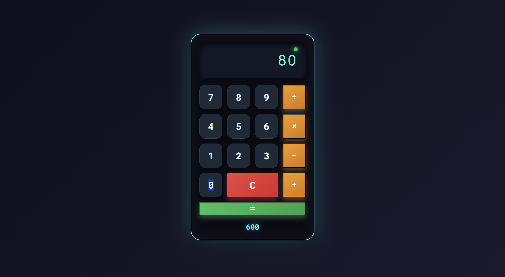
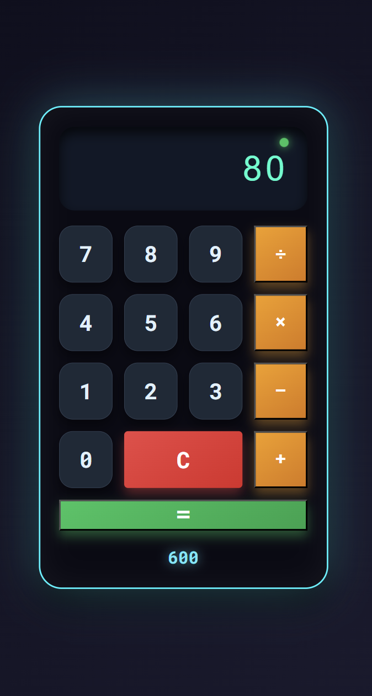

# 🧮 Calculator Pro

### Modern Calculator Built With HTML, CSS & JavaScript

  
  
  
  

### 🚀 One of My First JavaScript Projects

---

# 📖 About The Project

**Calculator Pro** is one of my first projects built with JavaScript.

The purpose of this project was to improve my understanding of:

- DOM Manipulation
- Event Handling
- JavaScript Functions
- Responsive Design
- User Interface Development
- Front-End Fundamentals

Although it's a simple calculator, it represents an important milestone in my web development journey.

---

# 🌐 Live Demo

### 🔗 Try it Online

### https://poria-dev.github.io/Calculator_Pro/

---

# ✨ Features

✅ Basic Arithmetic Operations

✅ Responsive Design

✅ Modern User Interface

✅ Fast & Lightweight

✅ Clean Code Structure

✅ Mobile Friendly

✅ Built With Vanilla JavaScript

---

# 🖥️ Desktop Preview

### Main Interface

  

---

### Windows Style View

  

---

# 📱 Mobile Responsive Design

  

---

# 🛠️ Technologies Used

| Technology | Usage |
|------------|--------|
| HTML5 | Structure |
| CSS3 | Styling |
| JavaScript | Functionality |

---

# 📚 What I Learned

During the development of this project I practiced:

- DOM Selection
- Event Listeners
- JavaScript Logic
- Functions
- CSS Flexbox
- Responsive Layouts
- Problem Solving
- UI Design Principles

---

# 🎯 Project Goals

This project was created to:

- Strengthen JavaScript fundamentals
- Practice real-world coding
- Learn responsive design techniques
- Build a complete project from scratch
- Improve front-end development skills

---

# 🔮 Future Improvements

- Scientific Calculator
- Dark Mode
- Keyboard Support
- Calculation History
- Better Animations
- Enhanced UX

---

# 👨‍💻 Developer

## Poria

**GitHub:** @poria_dev

> Building projects, learning every day, and improving one line of code at a time.

---

### ⭐ If you like this project, consider giving it a star!

Made with ❤️ by Poria

